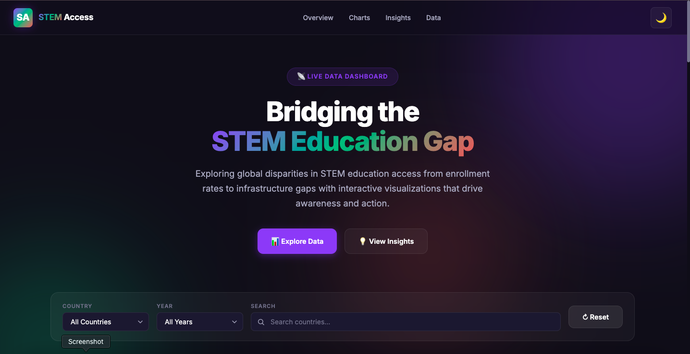
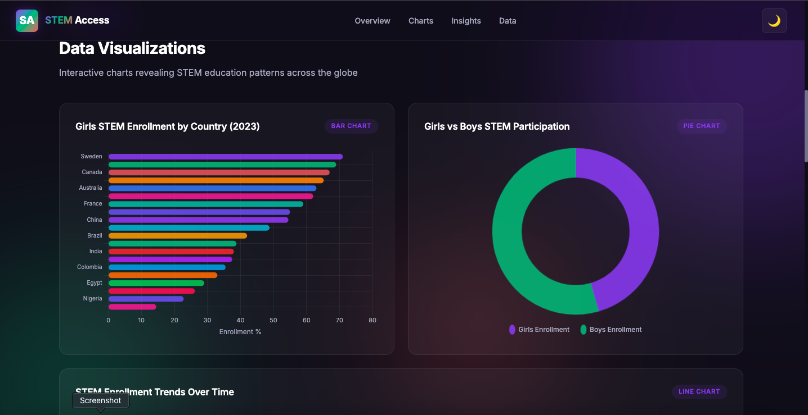
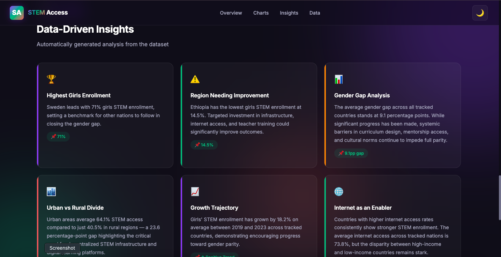

# 📊 STEM Access Awareness Dashboard

A modern, interactive web dashboard that visualizes STEM education access data highlighting disparities for girls and underserved communities worldwide.

Built as a portfolio-ready project demonstrating data analysis, frontend UI development, visualization skills, and storytelling with data.

[](https://stem-access.vercel.app)


---

## ✨ Features

- **Interactive Dashboard** — Hero section, stat cards, and smooth navigation
- **5 Chart Types** — Bar, Doughnut, Line, Grouped Bar, and Heatmap using Chart.js
- **Smart Insights** — Auto-generated data analysis with key findings
- **Dark / Light Mode** — Toggle between themes with one click
- **Filtering & Search** — Filter by country, year, or search by keyword
- **Sortable Data Table** — Browse, sort, and paginate the full dataset
- **CSV Download** — Export filtered data as a CSV file
- **Animated Counters** — Stat cards animate on page load
- **Fully Responsive** — Works on desktop, tablet, and mobile
- **Deployment Ready** — Configured for Render, Railway, or Vercel

---

## 📸 Screenshots

> After running the app, add screenshots here to showcase in your portfolio.

| Dashboard Hero | Charts Section | Insights Panel |
|:-:|:-:|:-:|
|  |  |  |

---

## 🛠️ Technologies Used

| Technology | Purpose |
|:--|:--|
| **HTML5** | Page structure and semantic markup |
| **CSS3** | Styling, glassmorphism, animations, responsive layout |
| **JavaScript (ES6+)** | App logic, data processing, DOM manipulation |
| **Chart.js 4** | Interactive data visualizations |
| **Python / Flask** | Lightweight backend server and data API |
| **Gunicorn** | Production WSGI server |

---

## 📁 Project Structure

```
stem-access-dashboard/
│
├── data/
│   └── stem_access_data.csv      # Sample dataset (100 rows, 20 countries)
│
├── static/
│   ├── style.css                 # Complete design system
│   └── app.js                    # Dashboard logic and chart rendering
│
├── templates/
│   └── index.html                # Main HTML template
│
├── app.py                        # Flask application
├── requirements.txt              # Python dependencies
├── README.md                     # This file
└── .gitignore                    # Git ignore rules
```

---

## 🚀 Getting Started

### Prerequisites

- Python 3.9 or higher
- pip (Python package manager)

### Installation

1. **Clone the repository**

```bash
git clone https://github.com/yourusername/stem-access-dashboard.git
cd stem-access-dashboard
```

2. **Create a virtual environment** (recommended)

```bash
python3 -m venv venv
source venv/bin/activate    # macOS / Linux
venv\Scripts\activate       # Windows
```

3. **Install dependencies**

```bash
pip install -r requirements.txt
```

4. **Run the application**

```bash
python app.py
```

5. **Open in your browser**

```
http://localhost:5001
```

---

## 🌐 Deployment

### Deploy to Render (Recommended)

1. Push your code to a GitHub repository
2. Go to [render.com](https://render.com) and create a **New Web Service**
3. Connect your GitHub repo
4. Use these settings:
   - **Build Command:** `pip install -r requirements.txt`
   - **Start Command:** `gunicorn app:app`
   - **Environment:** Python 3
5. Click **Deploy**

### Deploy to Railway

1. Push your code to GitHub
2. Go to [railway.app](https://railway.app) and create a new project
3. Connect your GitHub repo
4. Railway auto-detects Flask apps
5. Add a **Start Command** if needed: `gunicorn app:app`
6. Deploy

### Deploy to Vercel (Serverless)

1. Install Vercel CLI: `npm install -g vercel`
2. Create a `vercel.json` in the project root:

```json
{
  "builds": [{ "src": "app.py", "use": "@vercel/python" }],
  "routes": [{ "src": "/(.*)", "dest": "app.py" }]
}
```

3. Run `vercel` and follow the prompts

---

## 📊 Dataset

The dashboard uses a realistic sample dataset with **100 rows** covering **20 countries** from **2019–2023**.

| Field | Description |
|:--|:--|
| `country` | Country name |
| `year` | Data year (2019–2023) |
| `girls_stem_enrollment` | Girls STEM enrollment rate (%) |
| `boys_stem_enrollment` | Boys STEM enrollment rate (%) |
| `rural_access_rate` | STEM access rate in rural areas (%) |
| `urban_access_rate` | STEM access rate in urban areas (%) |
| `internet_access` | Internet access rate (%) |
| `graduation_rate` | STEM graduation rate (%) |
| `stem_funding_index` | Funding index (1–10 scale) |

---

## 🤝 Contributing

Contributions are welcome! Feel free to open issues or submit pull requests.

1. Fork the repository
2. Create a feature branch (`git checkout -b feature/new-chart`)
3. Commit your changes (`git commit -m 'Add radar chart'`)
4. Push to the branch (`git push origin feature/new-chart`)
5. Open a Pull Request

---

## 📄 License

This project is open source and available under the [MIT License].

---

**Built with 💜 for education equity**
